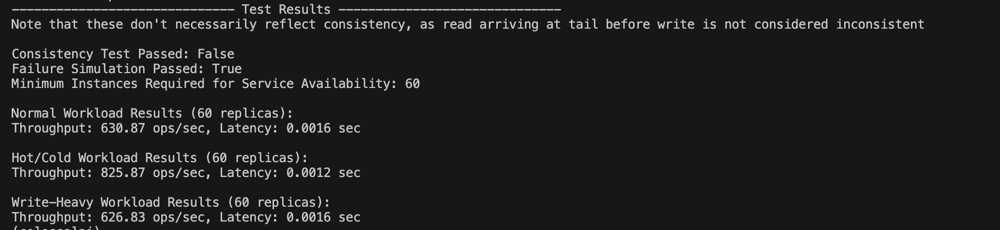

# CS739_Project_3 : Variable Membership KV Store

This project implements a durable, scalable key-value store with client and server components. The system supports multiple clients, ensures data persistence across crashes, and uses a chain replication approach to handle node failures and membership changes.

## Environment Setup
**Pick one of the two ways to install the environment:**
1. Use the Provided Python Virtual Environment:
```
python3 -m venv venv
source venv/bin/activate
```
2. Or Install Required Packages:
`pip install grpcio==1.67.0 protobuf==5.28.2 setuptools==67.8.0 psutil==5.9.5`

**Build protobuf files:**
`python -m grpc_tools.protoc -I=. --python_out=. --grpc_python_out=. kvstore.proto`

## Testing the System
* Note: If you spawn 80 servers or more on one machine, you may encounter grpc UNAVAILABLE errors potentially due to CPU resource depletion. Rerunning the tests may help.
```bash 
python3 test.py  
```

## 🚀Results 
* Using the 64-core Olvi machine


## Running the Server

To start the key-value store server, run the following command in the terminal:
python3 server.py 

## Running the Client

The client supports both `PUT` and `GET` operations. To interact with the server, use the following commands:

### PUT Operation

 
```bash
python3 client.py put <key> <value> --timeout <timeout> 
```


### GET Operation

```bash 
python3 client.py get <key> --timeout <timeout>
```
### Server Failure Simulation
The client also supports simulating server failures (clean or unclean shutdown). Use the following command to terminate a server:

```bash
python3 client.py die <server_type> --clean <0_or_1> --kill_ports <port_numbers>
```
<server_type>: Specify whether to kill the head, tail, or middle server.
<kill_ports>: Alternatively provide the port number of the server to terminate. Overrides <server_type>.
<clean>: A clean termination (1) ensures state is flushed before the server shuts down, while 0 terminates immediately.


### Server Leave Simulation
The client also supports simulating server for leaving (clean or unclean). Use the following command to make the server leave:

```bash
python3 client.py leave --kill_ports <list of ports to kill> --clean <0_or_1>
```
